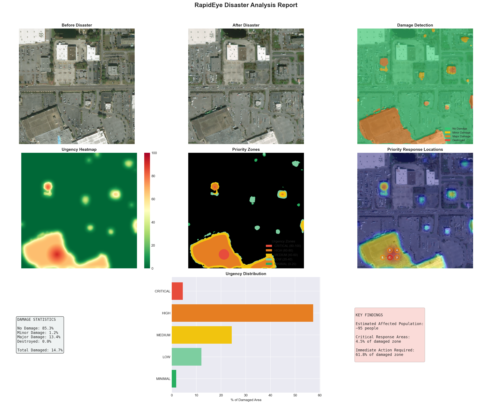
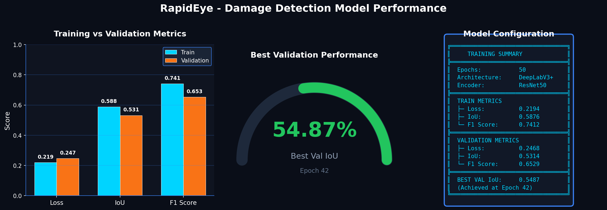

# RapidEye Command Center

**AI-Powered Disaster Detection & Response Prioritization**

> "We don't just detect disasters - we tell responders WHERE to help FIRST"

---

## Demo

[](https://drive.google.com/file/d/1Mh-HSRcL9KiUj4Pbk-VGfStJzqYPKzEk/view?usp=sharing)

<a href="https://drive.google.com/file/d/1Mh-HSRcL9KiUj4Pbk-VGfStJzqYPKzEk/view?usp=sharing">
  
</a>

*Click the image above to watch the full demo video*

---

## Sample Output


---

## Overview

RapidEye is an AI-powered system for rapid disaster damage assessment and response prioritization using satellite imagery. Our key innovation is the **Urgency Scoring System** that helps first responders focus on the highest priority areas.

## Key Features

- **Damage Detection**: DeepLabV3+ model trained on xView2 dataset
- **4-Class Segmentation**: No Damage, Minor, Major, Destroyed
- **Urgency Scoring**: Prioritizes response based on damage severity and spatial clustering
- **Priority Response Queue**: Ranked locations for immediate action
- **Real-time Analysis**: <5 seconds per image pair
- **Web Dashboard**: Production-ready command center interface

---

## Model Performance



| Metric | Train | Validation |
|--------|-------|------------|
| Loss | 0.2194 | 0.2468 |
| IoU | 0.5876 | 0.5314 |
| F1 Score | 0.7412 | 0.6529 |

**Best Validation IoU: 0.5487** (Epoch 42/50)

---

## Quick Start

### 1. Install Dependencies

```bash
pip install -r requirements.txt
```

### 2. Download Model Weights

Download `best.pth` and place in `models/` folder. (Contact repo owner for model weights)

Or train your own model (see Training section below).

### 3. Run the Server

```bash
uvicorn api:app --host 0.0.0.0 --port 8000
```

### 4. Open Dashboard

Navigate to http://localhost:8000

### 5. Test with Sample Images

Use the images in `test_images/` folder:
- `before_disaster.png` - Pre-disaster satellite image
- `after_disaster.png` - Post-disaster satellite image

Or click "Load Sample Data" in the dashboard for a demo.

---

## Project Structure

```
rapideye/
├── api.py                  # FastAPI backend
├── frontend/
│   └── index.html          # Command center dashboard
├── src/
│   ├── model.py            # DeepLabV3+ architecture
│   ├── dataset.py          # PyTorch Dataset class
│   ├── train.py            # Training script
│   ├── inference.py        # Prediction pipeline
│   ├── urgency.py          # Urgency scoring system
│   └── visualization.py    # Visualization utilities
├── models/
│   └── best.pth            # Trained model weights
├── test_images/            # Sample images for testing
│   ├── before_disaster.png
│   └── after_disaster.png
└── requirements.txt
```

---

## API Endpoints

| Endpoint | Method | Description |
|----------|--------|-------------|
| `/` | GET | Web dashboard |
| `/api/health` | GET | Health check |
| `/api/analyze` | POST | Analyze before/after images |
| `/api/sample` | GET | Demo with sample data |
| `/api/config` | GET | Get configuration |
| `/api/export/csv` | POST | Export priorities as CSV |

---

## Damage Classes

| Class | Color | Description |
|-------|-------|-------------|
| 0 | 🟢 Green | No Damage |
| 1 | 🟡 Yellow | Minor Damage |
| 2 | 🟠 Orange | Major Damage |
| 3 | 🔴 Red | Destroyed |

## Urgency Zones

| Zone | Score | Action |
|------|-------|--------|
| CRITICAL | 80-100 | Immediate response |
| HIGH | 60-80 | High priority |
| MEDIUM | 40-60 | Medium priority |
| LOW | 20-40 | Lower priority |
| MINIMAL | 0-20 | Monitor only |

---

## Training

To train the model on xView2 dataset:

```bash
# Preprocess data
python src/preprocessing.py --raw-dir ./archive --output-dir ./data/xview2_processed

# Train model
python src/train.py --epochs 50 --batch-size 8
```

### Model Configuration

| Parameter | Value |
|-----------|-------|
| Architecture | DeepLabV3+ |
| Encoder | ResNet50 (ImageNet pretrained) |
| Input | 6-channel (RGB before + RGB after) |
| Output | 4-class segmentation |
| Training Data | xView2 Dataset (~2,800 samples) |
| Epochs | 50 |
| Optimizer | AdamW |
| Loss | CrossEntropy + Dice |

---

## Tech Stack

- **Backend**: FastAPI, PyTorch
- **Frontend**: HTML/CSS/JavaScript
- **Model**: segmentation-models-pytorch
- **Data**: xView2, OpenCV, Albumentations

---

## License

MIT License

## Acknowledgments

- xView2 Challenge for the training dataset
- Maxar Technologies for satellite imagery
